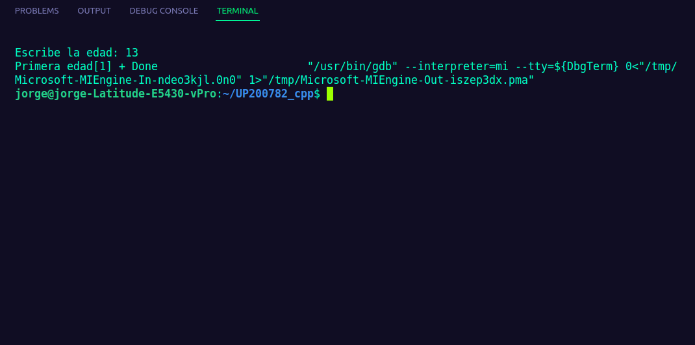

# UP200782_cpp  
Jorge Antonio Ruiz Esparza Galván  
>Unidad 1  
En este README se podrán ver todos los programas que se han estado realizando para la unidad 1. Todos en su totalidad están hechos en el lenguaje de C++  


   


# 1. Hola mundo  
```   
   #include <iostream>
using namespace std;
int main ()
{
    cout<< "Hola mundo cruel";
    return 0;
}  
``` 
  
# 2. Pares  
```
#include <iostream>
using namespace std;

int main(int argc, char const* argv[])
{
    cout << "Pares, o impares" << endl;
    "\n";
    cout << "Escriba el numero: " << endl;
    int n;
    cin >> n;
    if (n % 2 == 0)
    {
        cout << "Numero par" << endl;
    }
    else
    {
        cout << "Numero impar" << endl;
    }
    return 0;
}
// Jorge Antonio Ruiz Esparza Galván, UP200782
```  
 
# 3. Datos  
```  
// manejo de entradas y salidas
#include <iostream>
// printf y sanf
#include <stdio.h>

// para usar el espacio de nombres std
using namespace std;

// funcion principal

int main(int argc, char const *argv[])
{
    int entero = 20;
    float flotante = 20.8;
    double doble = 20.47893;
    char caracter = 'z';

    cout << "este programa muestra los tipos de datos en c++" << endl;
    cout << "El numero entero es: " << entero << endl;
    cout << "El tamaño del entero es : " << sizeof(entero) << " bytes" << endl;

    return 0;
}
//Jorge Antonio Ruiz Esparza Galván, UP200782  
``` 
  
# 4. Contador  
```  
#include <iostream>
using namespace std;
int main(int argc, char const *argv[])
{
    int n = 10, suma = 0, sumapar = 0, sumaimpar = 0;
    for (int i = 1; i <= n; i++)
    {
        printf("Contador: %d \n", i);
        suma += i;

        if (i % 2 == 0)
            sumapar = sumapar + i;

        if (i % 2 != 0)
            sumaimpar = sumaimpar + i;
    }

    printf("La suma de %d numeros es: %d \n", n, suma);
    printf("La suma de numeros pares es: %d \n", sumapar);
    printf("La suma de numeros impares es: %d \n", sumaimpar);
    return 0;
}
//Jorge Antonio Ruiz Esparza Galván, UP200782  
```  
  
# 5. Edades  
```  
#include <iostream>
using namespace std;
int main()
{
    int edad;
    cout << "Escribe la edad: ";
    cin >> edad;
    if (edad >= 1 & edad <= 150)
    {
        if (edad <= 30)
        {
            cout<< "Primera edad";
        }
        else if (edad >= 31 & edad <= 60)
        {
            cout << "Segunda edad";
        }
        else if (edad >= 61 & edad <= 90)
        {
            cout << "Tercera edad";
        }
        else if (edad >= 91 & edad <= 150)
        {
            cout << "Horas extras";
        }
        else if (edad < 1 and edad > 150)
            
        cout << "Invalido";
    }
}
```  
  


 


    
