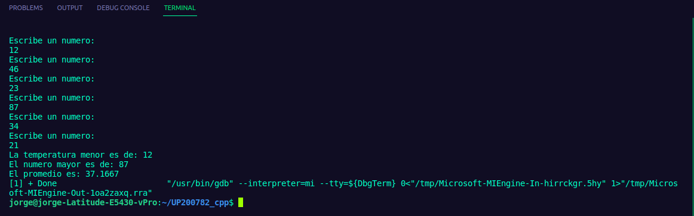

# UP200782_cpp  
Jorge Antonio Ruiz Esparza Galván  
# Unidad 2:   
En este README se podrán ver todos los programas que se han estado realizando para la unidad 2. Todos en su totalidad están hechos en el lenguaje de C++  


  
  
# 1. impuestos  
```  
#include <iostream>
#include <numeric>
using namespace std;
int main()
{
    int renta;
    float impuesto;
    cout << "Escribe la renta: " << endl;
    cin >> renta;
    if (renta >= 1)
    {
        if (renta < 10000)
        {
            impuesto = 0.5;
        }
        else if (renta >= 10000 && renta <= 20000)
        {
            impuesto = 0.15;
        }
        else if (renta > 20000 && renta <= 35000)
        {
            impuesto = 0.20;
        }
        else if (renta > 35000 && renta <= 60000)
        {
            impuesto = 0.30;
        }
        else if (renta > 60000)
        {
            impuesto = 0.45;
        }
    }
    cout << "El impuesto es de: " << impuesto << endl;
    cout << "El pago total es de: " << renta * impuesto + renta << endl;
    return 0;
}  
```  
  
# 2 . Puntos empleado  
```  
#include <iostream>
using namespace std;
int main()
{
    float pun;
    cout << "Escribe la puntuación: " << endl;
    cin >> pun;
    if (pun >= 0)
    {
        if (pun == 0.0)
        {
            cout << "Puntuacion inaceptable" << endl;
        }
        else if (pun == 0.4)
        {
            cout << "Puntuación aceptable" << endl;
        }
        else if (pun >= 0.6)
        {
            cout << "Tu puntuación es meritoria" << endl;
        }
        cout << "Tu bono será de: " << 2400*pun;
    }
    return 0;
}  
```  
  
# 3 . Edad juegos  

```  
 #include <iostream>
using namespace std;
int main()
{
    int e;
    cout << "Ingrese la edad" << endl;
    cin >> e;
    if (e >= 1)
    {
        if (e < 4)
        {
            cout << "La entrada es gratis";

        }
        else if (e >= 4 && e <= 18)
        {
            cout << "Debe pagar $5";
        }
        else if (e > 18)
        {
            cout << "Debe pagar $10";
        }
    }
    return 0;
}  
```  
  
# 4 . Pizzeria  
```  
#include <iostream>
#include <string>
using namespace std;
int main()
{
    int p;
    int a;
    cout << "Elige el tipo de pizza presionando su numero: " << endl;
    cout << "1. Vegetariana" << endl
         << "2. Carnivora" << endl;
    cin >> p;
    switch (p)
    {
    case 1:
        cout << "Elegiste pizza vegetariana. Ahora elige el ingrediente especial: " << endl;
        cout << "1. Pimiento" << endl
             << "2. Tofu" << endl;
        cin >> a;

        switch (a)
        {
        case 1:
            cout << "Tu pizza es vegetariana y lleva mozzarella, tomate y pimiento" << endl;

            break;
        case 2:
            cout << "Tu pizza es vegetariana y lleva mozzarella, tomate y tofu" << endl;
            break;
        default:
            cout << "No tenemos ese ingrediente" << endl;
        }

        break;

    case 2:
        cout << "Elegiste pizza carnivora. Ahora elige el ingrediente especial: " << endl;
        cout << "1. Peperoni" << endl
             << "2. Jamón" << endl
             << "3. Salmón" << endl;
        cin >> a;
        switch (a)
        {
        case 1:
            cout << "Tu pizza es carnivora y lleva mozzarella, tomate y Peperoni" << endl;

            break;
        case 2:
            cout << "Tu pizza es carnivora y lleva mozzarella, tomate y Jamón" << endl;
            break;
        case 3:
            cout << "Tu pizza es carnivora y lleva mozzarella, tomate y Salmón" << endl;
            break;
        default:
            cout << "No tenemos ese ingrediente" << endl;
        }
        break;

    default:
        cout << "No tenemos ese tipo de pizza" << endl;
    }
    return 0;
}  
```  
  
# 5 . Temperaturas  
```  
#include <iostream>
using namespace std;

float numeros[6];
float menor;
float mayor;
float suma;

int main() {

  for (int i = 0 ; i<= 5 ; i++)
    {
      cout << "Escribe un numero: " << endl;
      cin >> numeros[i];
    }
  mayor = numeros[0];
  menor = numeros[0];  
  for (int i = 0 ; i<= 5 ; i++)
    {      
      if (mayor > numeros [i]) 
      {
        mayor = numeros[i];
      }
      if(menor < numeros [i])
      {
        menor = numeros[i];
      }
    }
    for (int i = 0 ; i<= 5 ; i++)
    {
        suma = numeros[i] + suma;
    }
  cout << "La temperatura menor es de: " <<mayor<< endl;
  cout << "El numero mayor es de: " <<menor<< endl; 
  cout << "El promedio es: " << suma/6 << "grados" << endl; 
  return 0;
}  
```  
  
# 6 . Cantidad precio  
```  
#include <iostream>
using namespace std;
int productos;
float precio;
float resultado;
int main()
{
    do
    {
        cout <<"Ingresa el numero del producto: " << endl;
        cin >> productos;
        if (productos >0)
        {
            cout << "Ahora el precio: " << endl;
            cin >> precio;
             resultado += precio;
        }
        
        
        
    } while (productos > 0);
     cout << "La suma total es de: " << resultado << endl;
    
    
}  
```  
  
# 7 . Binario a decimal  
```  
#include <iostream>
#include <cmath>
using namespace std;
int main()
{
    int exp,digito;
    double binario, decimal;
   cout << "Introduce numero en Binario: " << endl;
   cin >> binario;
   exp=0;
   decimal=0;
   while(((int)(binario/10))!=0)
   {
           digito = (int)binario % 10;
           decimal = decimal + digito * pow(2.0,exp);
           exp++;
           binario=(int)(binario/10);
   }
   decimal=decimal + binario * pow(2.0,exp);
   cout << endl << "Decimal: " << decimal << endl;
  return 0;
}  
```  
  
# 8. Abecedario  
```  
#include <iostream>
using namespace std;
 int main(){
    char letra = 'A';
    for (int i = 0; i < 26; i++)
    {
        cout << letra << endl;
        letra = letra + 1;

    }


    return 0;
 }
 //Jorge Antonio Ruiz Esparza Galván UP20078200782  
 ```  
  }
# 9 . Tablas  
```  
#include <iostream>
using namespace std;
int main()
{
    int n = 5;
    int a = 1;
    int b = 10;

    cout << "Con for:" << endl;

    cout << "ASCENDENTE" << endl;

    for (int i = 0; i <= 10; i++)
    {
        int r = n * i;
        cout << n << " X " << i << " = " << r << endl;
    }
    cout << endl;

    cout << "DESCENDENTE" << endl;

    for (int i = 10; i >= 1; i--)
    {
        int r = n * i;
        cout << n << " X " << i << " = " << r << endl;
    }
    cout << "Ahora con while:", cout << endl;

    cout << "ASCENDENTE" << endl;

    while (a <= 10)
    {
        cout << n << " X " << a << " = " << n * a++ << endl;
    }
    cout << endl;

    cout << "DESCENDENTE" << endl;

    while (b <= 10 and b >= 1)
    {
        cout << n << " X " << b << " = " << n * b-- << endl;
    }
    cout << endl;
    cout << "Ahora con do while" << endl;
    cout << "ASCENDENTE" << endl;
    a=0;
    n=5;
    do
    {
        cout << n << " X " << a << " = " << n * a++ << endl; 
    } while (a <= 10 and a >= 1);
    cout << endl;
    cout << "DESCENDENTE" << endl;
    n=5;
    b=10;
      do
    {
        cout << n << " X " << b << " = " << n * b-- << endl; 
    } while (b <= 10 and b >= 1);
    

    return 0;
   
    
}  
```  
  
    
  
# 10 . ForFor  
```  
#include <iostream>
using namespace std;
int main ()
{
    int a , b;

for ( a = 1; a <= 10; a++)
{
    for (b = 1; b <= 10; b++)
    {
        cout << a << " X " << b << " = " << a*b << endl;
    }
    cout << endl;
    
}


return 0;
}  
```  
  
   
  
# 11 . Ciclo while  
```  
#include<iostream>
using namespace std;
int main(){
    int a,i;
    char opcion='s';
    while (opcion=='s')
    {
    cout<<"Ingresa un numero: ";
    cin>>a;  
    i=1;
    do
    {
        cout<<a<<" x "<<i<<" = "<<a*i<<endl;
        i++;
    } while (i<=10);
    cout<<"Deseas otro <s/n>";
    cin>>opcion;  
    }
    cout<<"... Hecho";
    return 0;
}  
```  
  
  


 


    
