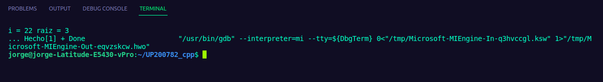
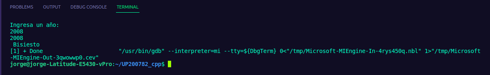
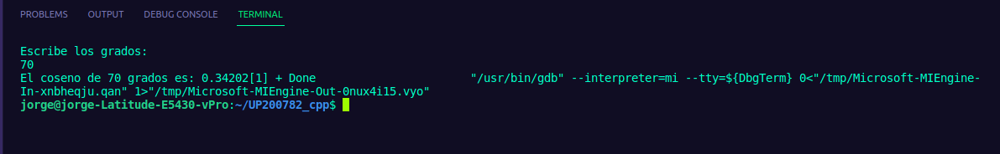
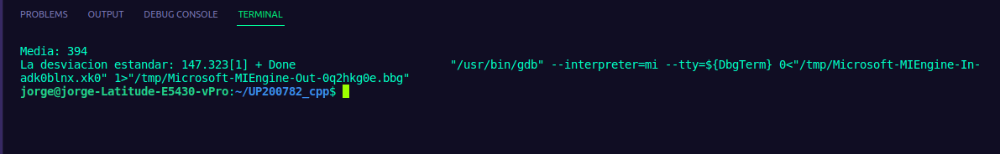
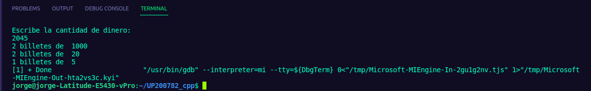

# UNIT 3 
Jorge Antonio Ruiz Esparza Galván 
# In this unit we did a lot of programs using the new functions and facilities that the teacher taught us. 
On this readme i will put 9 programs we made during the class 
# 1 Bisección 
```
 #include <iostream>
 #include <cmath>
 using namespace std;

double FuncionEcuacion1(double x){
    return (pow(x,2)-8*x+15);
}

int main(){
    double x1=-10;
    double x2=4.5;
    double xm,y1,y2;

    double Es=0.00001;
    double Er=abs(x2-x1);
    
    int i=1;
    while (Er>Es){
        xm=(x1+x2)/2;
        y1=FuncionEcuacion1(x1);
        y2=FuncionEcuacion1(xm);
        if (y1*y2 <0 ){
            x2=xm;
        } else {
            x1=xm;
        }
        Er=abs(x2-x1);
        i=i+1;
    }
    cout<<"i = "<<i<<" raiz = "<<xm<<endl;
    cout<<"... Hecho";
    return 0;
} 
``` 
 
# 2 Año bisiesto 
``` 
#include <iostream>
using namespace std;

bool Bisiesto(int año){
    bool r;
    r = año%400==0 || año%4==0 && año%100!=0;
    return r;
}

int main(){
int año;
cout<<"Ingresa un año: " << endl;
cin>>año;
if(Bisiesto(año)){
    cout<<año<< endl << " Bisiesto" << endl;
} else{
    cout<<año<< endl << " no Bisiesto" << endl;
}
return 0;
} 
``` 
 
# 3 Coseno 
``` 
#include <iostream>
#include <math.h>
using namespace std;

double G2R(double g){
    double r;
    r=g*M_PI/180;
    return r;
}

long int factorial(int x){
    int factorial=1;
    while (x>0)
    {
        factorial=factorial*x;
        x--;
    }
    return factorial;
}

double coseno(double g, int i){
    double c;
    c=pow(-1,i)*pow(G2R(g),2*i)/(factorial(2*i));
    return c;
}

int main(){
    int g;
    double x1=10;
    double Es=0.00001;
    double c=0;

    double Er=x1-c;
    int i=0;
    cout<< "Escribe los grados: " << endl;
    cin>>g;

    while(Er>Es){
        x1=c;
        c=c+coseno(g,i);
        Er=abs(x1-c);
        i++;
    }  
    
    cout<<"El coseno de "<<g<<" grados es: "<<c;
    return 0;
} 
``` 
 
# 4 Desviación estandar 
``` 
#include <iostream>
#include <math.h>
using namespace std;
 
 double media(double x[],int n){
    double media=0;
    for (int i = 0; i < n; i++)
    {
        media=media+x[i];
    }
    media=media/n;
    return media;
 }

 double desviacion(double x[], int n){
   double me= media(x,n);
   double des=0;
   for (int i = 0; i < n; i++)
   {
      des=des+pow(x[i]-me,2);
   }
   des=sqrt(des/n);
   return des;
 }

 int main(){
    double numeros[]={600,470,170,430,300};
    int n;
    n=sizeof(numeros)/8;
    cout<<"Media: "<<media(numeros,n)<<endl;
    cout<<"Desviacion estandar: "<<desviacion(numeros,n);
    return 0;
 } 
 ``` 
  
 # 5 Desgloce de moneda 
 ``` 
 #include<iostream>
using namespace std;
int main(){
    int dinero =8358, i=0;
    int cambio[10]={1000,500,200,100,50,20,10,5,2,1};
    while (dinero>0)
    {
        if (dinero>=cambio[i])
        {
            cout<<dinero/cambio[i]<< " billetes de  " <<cambio[i]<<endl;
            dinero=dinero%cambio[i];
        }
        i++;
    }
    return 0;
}
``` 
 


 


    
