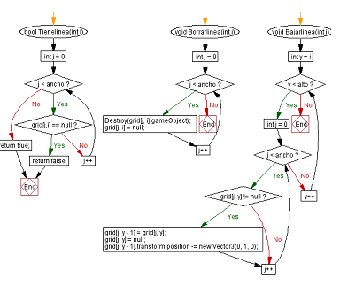
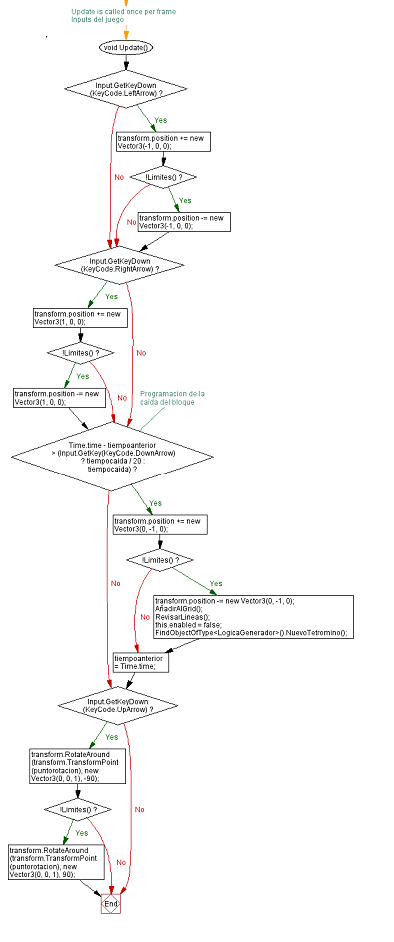
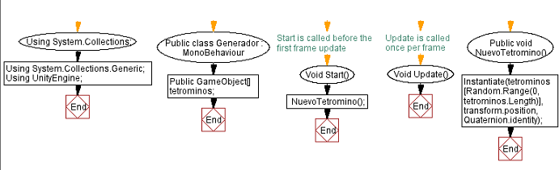

# Devloping a game on UNITY
Students: Jorge Antonio Ruiz Esparza Galván and Jose Alberto Flores Martinez  
# For the final project, we finished the Tetris we have been developing since the beginning of the quarter. The game was made on the program "UNITY" and with the C# lenguaje.  
The flow chart of the game is divided in two parts:  
  

This parts represents how the lines are erased once you make a TETRIS  
  

This part represents the inputs of the game  
  

This parts represents the appearance of the tetrominos  
  
# Hereyou can see the code of the game. The code has been divided in two parts, the logic of the terominos, and the logic of the generator.  
Tetrominos logic:  
```  
using System.Collections;
using System.Collections.Generic;
using UnityEngine;
using UnityEngine.SceneManagement;

public class LogicaTetromino : MonoBehaviour
{
    //Asignar variables
    private float tiempoanterior;
    private float tiempocaida = 0.8f;
    public static int alto = 20;
    public static int ancho = 10;
    public Vector3 puntorotacion;
    private static Transform[,] grid = new Transform[ancho, alto];
    // Start is called before the first frame update
    void Start()
    {

    }

    // Update is called once per frame
    //Inputs del juego
    void Update()
    {
        if (Input.GetKeyDown(KeyCode.LeftArrow))
        {
            transform.position += new Vector3(-1, 0, 0);
            if (!Limites())
            {
                transform.position -= new Vector3(-1, 0, 0);
            }
        }
        if (Input.GetKeyDown(KeyCode.RightArrow))
        {
            transform.position += new Vector3(1, 0, 0);
            if (!Limites())
            {
                transform.position -= new Vector3(1, 0, 0);
            }
        }
        //Programacion de la caida del bloque
        if (Time.time - tiempoanterior > (Input.GetKey(KeyCode.DownArrow) ? tiempocaida / 20 : tiempocaida))
        {
            transform.position += new Vector3(0, -1, 0);
            if (!Limites())
            {
                transform.position -= new Vector3(0, -1, 0);
                AñadirAlGrid();
                RevisarLineas();
                this.enabled = false;
                FindObjectOfType<LogicaGenerador>().NuevoTetromino();
            }
            tiempoanterior = Time.time;

        }
        if (Input.GetKeyDown(KeyCode.UpArrow))
        {
            transform.RotateAround(transform.TransformPoint(puntorotacion), new Vector3(0, 0, 1), -90);
            if (!Limites())
            {
                transform.RotateAround(transform.TransformPoint(puntorotacion), new Vector3(0, 0, 1), 90);
            }
        }
    }
    bool Limites()
    {
        //Limites de pantalla del juego
        foreach (Transform hijo in transform)
        {
            int enteroX = Mathf.RoundToInt(hijo.transform.position.x);
            int enteroY = Mathf.RoundToInt(hijo.transform.position.y);
            if (enteroX < 0 || enteroX >= ancho || enteroY < 0 || enteroY >= alto)
            {
                return false;
            }

            if (grid[enteroX, enteroY] != null)
            {
                return false;

            }
        }
        return true;
    }
    void AñadirAlGrid()
    {
        foreach (Transform hijo in transform)
        {
            int enteroX = Mathf.RoundToInt(hijo.transform.position.x);
            int enteroY = Mathf.RoundToInt(hijo.transform.position.y);
            grid[enteroX, enteroY] = hijo;
            if (enteroY >= 19)
            {
                SceneManager.LoadScene(SceneManager.GetActiveScene().buildIndex);
            }
        }
    }
    void RevisarLineas()
    {
        for (int i  = alto -1; i >= 0; i--)
        {
            if (Tienelinea(i))
            {
                Borrarlinea(i);
                Bajarlinea(1);
            }
        }
    }
    bool Tienelinea(int i)
    {
        for (int j = 0; j < ancho; j++)
        {
            if (grid[j,i] == null)
            {
                return false;
            }
        }
        return true;
    }
    void Borrarlinea(int i)
    {
        for (int j = 0; j < ancho; j++)
        {
            Destroy(grid[j, i].gameObject);
            grid[j, i] = null;
        }
    }
    void Bajarlinea(int i)
    {
        for (int y = i; y < alto; y++)
        {
            for (int j = 0; j < ancho; j++)
            {
                if (grid[j, y] != null)
                {
                    grid[j, y - 1] = grid[j, y];
                    grid[j, y] = null;
                    grid[j, y - 1].transform.position -= new Vector3(0, 1, 0);
                }
            }
        }
    }

}  
```  
Generatos logic:  
```  
using System.Collections;
using System.Collections.Generic;
using UnityEngine;

public class LogicaGenerador : MonoBehaviour
{
    public GameObject[] tetrominos;
    // Start is called before the first frame update
    void Start()
    {
        NuevoTetromino();
    }

    // Update is called once per frame
    void Update()
    {
       
    }
    public void NuevoTetromino()
    {
        Instantiate(tetrominos[Random.Range(0, tetrominos.Length)], transform.position, Quaternion.identity);
    }
}  
```  
# In this part we will include a small summary of how the code is structured  


 


    
